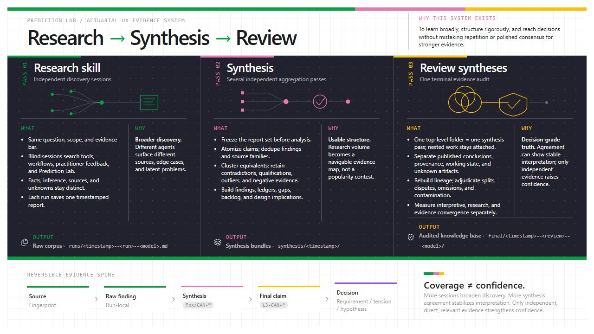
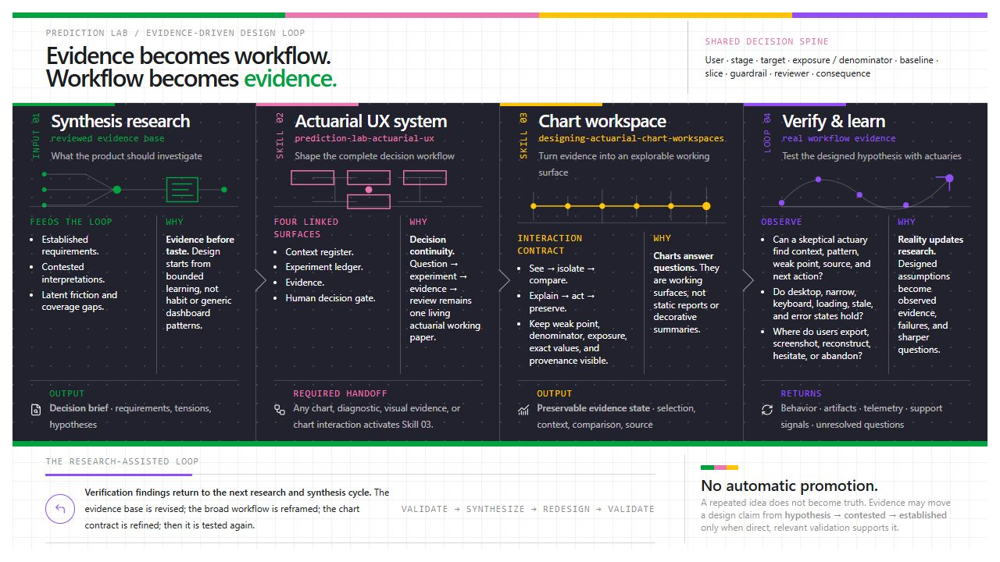

# Experiments

A working product slice for [Prediction Lab](https://predictionlab.ai): you
state a goal and hard guardrails, a modeling agent runs seven experiments
against a real insurance pricing model, every experiment ends in a written
verdict, and the one winner earns a review a human has to sign.

**Live**: https://web-production-563b7.up.railway.app

Synthetic data, real fits. Every number on screen comes out of a genuine
Poisson GLM fit by the backend at run time.

## Research and design system

This demo was not designed from generic ML-dashboard conventions. And it will be further refined and improved by a repeatable evidence-to-design system built around actuarial decisions.

### Research → synthesis → review



Independent research broadens discovery. Multiple synthesis passes structure
the corpus without turning repetition into proof. A terminal review then
separates interpretive agreement from genuinely independent evidence and keeps
every final claim traceable to its source.

### Evidence → workflow → chart → evidence



Reviewed findings enter the broad Prediction Lab workflow as established
requirements, contested interpretations, or hypotheses. When that workflow
reaches a chart or diagnostic, the chart-workspace skill turns it into a
working surface: **see → isolate → compare → explain → act → preserve**. Real
workflow testing then returns observed behavior, failures, and unanswered
questions to the next research cycle.

### Custom skills

| Skill | Job |
|---|---|
| [`researching-actuarial-ux`](.claude/skills/researching-actuarial-ux/SKILL.md) | Run independent actuarial UX research and synthesize frozen report sets. |
| [`reviewing-actuarial-ux-syntheses`](.claude/skills/reviewing-actuarial-ux-syntheses/SKILL.md) | Audit multiple syntheses, repair lineage, preserve disputes, and produce decision-grade findings. |
| [`prediction-lab-actuarial-ux`](.claude/skills/prediction-lab-actuarial-ux/SKILL.md) | Turn evidence into a living actuarial working paper across context, experiments, evidence, and human review. |
| [`designing-actuarial-chart-workspaces`](.claude/skills/designing-actuarial-chart-workspaces/SKILL.md) | Make charts answer actuarial questions while preserving exact values, weak points, provenance, and state. |

## Stack

- **Backend**: Rust, axum, async-graphql, sqlx, Postgres (Railway), nalgebra
- **Frontend**: TypeScript, React, Vite, GraphQL over plain typed fetch
- **No LLM anywhere**: the modeling agent is a deterministic planner with
  two-layer prose templates (dense expert copy plus a Plain terms gloss), and
  the context expert routes questions to real artifacts rather than
  generating text

## Three things a reader can do

1. **Watch the run.** Seven experiments fit against a real backend, each one
   landing with chips, fold dots, and a written verdict.
2. **Open the evidence.** Every landed card carries what the platform kept:
   fit facts (rows, parameters, IRLS iterations, deviance, AIC), the lift
   staircase by risk decile, the five fold deltas, and one chart per
   archetype drawn from the same numbers the verdict was written from. A
   verdict without its artifact is a claim, so the artifact ships with it.
3. **Ask about the run** (the button, or the shortcut). The context expert
   answers from this run's artifacts, shows the steps it took, cites the
   experiments it read, and draws the relevant chart. A question with no
   artifact behind it gets an honest miss instead of a guess. It reads and it
   draws; it cannot fit, merge, or approve anything.

Evidence lives in the `platform` crate and never in the agent contract, so
the agent still writes its prose from scalars while the console shows the
artifacts those scalars came from.

## Architecture, and the one boundary that matters

```
crates/
  core       shared protocol types, zero deps
  datagen    deterministic 100k-row synthetic auto book (own PRNG, fixed seed)
  fit        IRLS Poisson + NB2 GLM, natural cubic splines, exposure-weighted
             Gini, deviance, AIC, 5-fold CV
  platform   run executor, data profiler, GUARDRAILS, filing + credibility
  agent      playbook planner + verdict templates. Depends on core ONLY
  server     GraphQL API, role enforcement, persistence, serves the frontend
```

The UI promises "hard limits the platform checks outside the agent." That is
a compile-time fact here: the `agent` crate cannot import `fit` or
`platform`, so it never sees a dataset row or a fit artifact. It reads
platform-computed summaries and writes prose. The platform computes every
guardrail number.

Role enforcement is in the GraphQL layer, not the UI: `approveReview`
rejects the agent role in the resolver. The agent opens reviews through the
same mutation path a human would use.

## The dataset is rigged so honesty is measurable

100,000 policies, fixed seed, byte-identical regeneration. Planted truths,
one per experiment archetype:

| planted truth | experiment that finds it |
|---|---|
| U-shaped age curve vs 5 coarse bands in v12 | EXP-01 spline, candidate |
| exactly zero age x vehicle age interaction | EXP-02, dies on fold jitter |
| filed relativities drifted from modern estimates | EXP-03, killed by the territory rail |
| accident effect linear to 3 then flat | EXP-04 capped count, candidate |
| gamma-mixed overdispersion, independent of features | EXP-05, AIC prefers NB2 but lift is flat |
| mileage missing not at random, clustered by region | EXP-06, refused before fitting |
| spline and accidents fix different residuals | EXP-07 combo, winner |

Filed territory relativities stay frozen in every fit (they enter the
offset), so they move 0% by construction. The territory guardrail measures
indirect zone-level average rate movement, which is nonzero because the new
factors correlate with geography. EXP-03 is the one experiment that unfreezes
them, and its direct relativity movement is what kills it.

## Run it locally

Needs Rust, Node 22+, and a `DATABASE_URL` pointing at any Postgres.

```
cargo run --release -p plab-datagen --bin datagen   # writes data/policies.csv
cargo run --release -p plab-platform --bin run-cli  # whole run on the CLI, no DB
DATABASE_URL=... cargo run --release -p plab-server # migrates, seeds, serves
cd frontend && npm ci && npm run dev                # dev UI on :5173
```

## Verification

```
cargo test            # fitting math incl hand-computed Gini and deviance cases
cd frontend
npx playwright test   # against PLAB_URL: screenshots both views and themes,
                      # plus the GraphQL run-review-permission integration test
```

## Honesty rules baked into the copy

Deviance is nonnegative and only its change is displayed. Cross-family
comparisons use AIC, never deviance. Every sentence that interpolates a
computed number stays true for any value the computation can produce (the
review's shrinkage wording adapts to whatever the holdout really did). No em
dashes, no periods on display strings, and the Plain terms toggle keeps one
vetted gloss line under every result.

Ryan Allen · [fullbuild.ai](https://fullbuild.ai)
